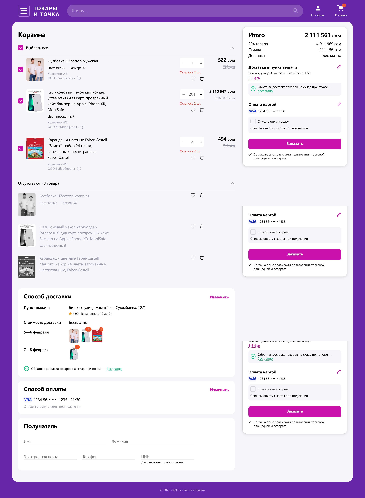

# Marketplace Cart «Товары и точка»

Реализована корзина для маркетплейса «Товары и точка» по макету из Figma с учетом Pixel Perfect. Вёрстка адаптирована под разные экраны, интерактивность элементов добавлена на чистом JavaScript без сторонних библиотек и фреймворков. Включен функционал расчёта корзины, изменения количества товаров, удаления, добавления в избранное, валидации формы. Реализованы модальные окна для выбора пунктов выдачи и карт оплаты.

## Демо

[Посмотреть проект на GitHub Pages](https://lolitaklim.github.io/marketplace-cart/)

## Скриншоты

### Desktop версия

### Mobile версия

